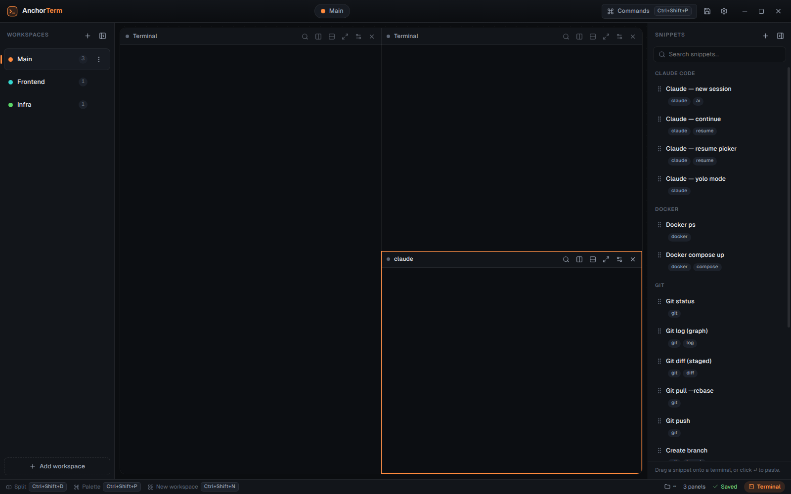
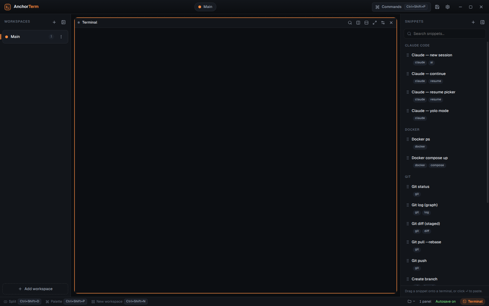

<div align="center">

# AnchorTerm

**A multi-panel terminal command center for AI-assisted development — Linux & macOS (and Windows).**

Real terminals in resizable panels, organised into workspaces, with a snippets
palette and — the headline feature — **persistence**: close the app or reboot,
and your tabs, layout, each panel's working directory, and your **Claude Code
sessions** come back exactly where you left them.





[](https://github.com/alanperius/anchorterm-releases/releases/latest)

</div>

> This repository hosts the **downloadable installers** for AnchorTerm. Grab the
> latest build for your OS below.

## Download

Get the latest installer from the **[Releases page](https://github.com/alanperius/anchorterm-releases/releases/latest)**:

| OS | File | Notes |
| --- | --- | --- |
| **Linux** — Debian/Ubuntu/Pop!_OS | `anchorterm_*_amd64.deb` | installs to your launcher |
| **Linux** — any distro | `AnchorTerm-*.AppImage` | portable, no install |
| **macOS** — Apple Silicon | `AnchorTerm-*-arm64.dmg` | M1/M2/M3… |
| **macOS** — Intel | `AnchorTerm-*.dmg` | |
| **Windows** | `AnchorTerm-Setup.exe` | installer · also a portable `.exe` |

### ⬇️ Direct downloads (latest)

- 🐧 **Linux · Debian/Ubuntu/Pop!_OS** — [`anchorterm_amd64.deb`](https://github.com/alanperius/anchorterm-releases/releases/latest/download/anchorterm_amd64.deb)
- 🐧 **Linux · portable (any distro)** — [`AnchorTerm.AppImage`](https://github.com/alanperius/anchorterm-releases/releases/latest/download/AnchorTerm.AppImage)
- 🍎 **macOS · Apple Silicon** — [`AnchorTerm-arm64.dmg`](https://github.com/alanperius/anchorterm-releases/releases/latest/download/AnchorTerm-arm64.dmg)
- 🍎 **macOS · Intel** — _publishing shortly_
- 🪟 **Windows · installer (recommended)** — [`AnchorTerm-Setup.exe`](https://github.com/alanperius/anchorterm-releases/releases/latest/download/AnchorTerm-Setup.exe)
- 🪟 **Windows · portable (no install)** — [`AnchorTerm-Portable.exe`](https://github.com/alanperius/anchorterm-releases/releases/latest/download/AnchorTerm-Portable.exe)

## Install

### 🐧 Linux — Debian / Ubuntu / Pop!_OS (`.deb`)

The reliable one-liner (downloads + installs; avoids broken browser downloads):

```bash
curl -fL -o anchorterm.deb \
  https://github.com/alanperius/anchorterm-releases/releases/latest/download/anchorterm_amd64.deb
sudo apt install ./anchorterm.deb
```

Prefer the browser? Download the `.deb` from the Releases page, then either
**double-click it** (installs via your software centre) or
`sudo apt install ~/Downloads/anchorterm_amd64.deb`.

> **`E: Unsupported file … given on commandline`** means the file you downloaded
> is incomplete/corrupted (not a real `.deb`) — use the `curl` command above. A
> good file is ~99 MB; check with `file anchorterm.deb` → *"Debian binary package"*.

Then launch from your apps menu (**AnchorTerm**) or run `anchorterm`.

### 🐧 Linux — any distro (AppImage, no install)

```bash
curl -fL -o AnchorTerm.AppImage \
  https://github.com/alanperius/anchorterm-releases/releases/latest/download/AnchorTerm.AppImage
chmod +x AnchorTerm.AppImage
./AnchorTerm.AppImage
```

### 🍎 macOS (`.dmg`)

1. Download the build for your chip ( menu → **About This Mac**: "Apple M…" =
   Apple Silicon, otherwise Intel):

   ```bash
   # Apple Silicon (M1/M2/M3/M4)
   curl -fL -o AnchorTerm.dmg \
     https://github.com/alanperius/anchorterm-releases/releases/latest/download/AnchorTerm-arm64.dmg

   # Intel
   curl -fL -o AnchorTerm.dmg \
     https://github.com/alanperius/anchorterm-releases/releases/latest/download/AnchorTerm-x64.dmg
   ```

2. Open `AnchorTerm.dmg` and drag **AnchorTerm** onto the **Applications** folder.
3. First launch (the app is unsigned): in Applications, **right-click AnchorTerm →
   Open → Open**. If macOS still refuses, run once:

   ```bash
   xattr -dr com.apple.quarantine /Applications/AnchorTerm.app
   ```

### 🪟 Windows (`.exe`)

Download the **installer** —
[`AnchorTerm-Setup.exe`](https://github.com/alanperius/anchorterm-releases/releases/latest/download/AnchorTerm-Setup.exe)
— and run it. On the blue SmartScreen prompt (unsigned app) click
**More info → Run anyway**, then follow the wizard. There's also a **portable**
[`AnchorTerm-Portable.exe`](https://github.com/alanperius/anchorterm-releases/releases/latest/download/AnchorTerm-Portable.exe)
that runs without installing.

## Updates

AnchorTerm checks for new versions automatically:

- **Windows & Linux AppImage** — updates download in the background; you'll see
  **“Update ready — Restart & update”** and it installs on restart.
- **Linux `.deb` & macOS** — you'll be notified that a new version exists with a
  **Download** button (auto-install isn't available there: `.deb` is managed by
  `apt`, and macOS needs a signed app). Grab the new file from Releases.

## What it is

AnchorTerm is a desktop "command center" for people who work with several
terminals and AI coding agents at once. Instead of juggling tabs and losing your
place after a reboot, AnchorTerm keeps a durable picture of your work — the
panels, where each one lives, and which ones were running Claude Code — and
brings it all back on the next launch.

## Features

- **Real terminals** — full shells (not a web sandbox), true colour, clickable
  links, copy/paste, in-terminal search.
- **Multi-panel layouts** — split horizontally/vertically into 1–16 panels, drag
  the dividers to resize, focus, maximize, close.
- **Workspaces** — colour-coded tabs, each with its own layout; create, rename,
  reorder, recolour.
- **Snippets** — searchable, categorised command/prompt snippets. **Drag one
  onto a terminal to paste it**, or hit ↵.
- **Persistence & session resume** — autosave + a Save button. On restart every
  workspace and layout is recreated, each panel reopens in its **real saved
  working directory**, and panels that were running **Claude Code resume with
  `claude --resume <session>`** — picking up the conversation where you left off,
  *without having to exit Claude first*.
- **Command palette** (`Ctrl+Shift+P` / `⌘K`) — fuzzy-search every action.
- **Themes** — four cohesive dark themes, switchable live.

## Quick start

1. Open AnchorTerm — you get one workspace with one terminal.
2. **Split** it with `Ctrl+Shift+D` (right) or `Ctrl+Shift+E` (down) — or the
   icons in each panel's header.
3. `cd` into a project and run `claude` in a panel. After a moment a **Claude**
   badge appears on that panel.
4. Hit **Save** (`Ctrl+Shift+S`). Close the app, reboot — reopen and every panel
   returns in its directory, and Claude panels resume their session.
5. Press `Ctrl+Shift+P` (palette) any time to find an action or paste a snippet.

## Keyboard shortcuts

macOS uses `⌘`; Linux/Windows use `Ctrl+Shift`.

| Action | macOS | Linux / Windows |
| --- | --- | --- |
| Command palette | `⌘K` | `Ctrl+Shift+P` |
| Save workspace | `⌘S` | `Ctrl+Shift+S` |
| New workspace | `⌘N` | `Ctrl+Shift+N` |
| Next / previous workspace | `⌘⇧]` / `⌘⇧[` | `Ctrl+Shift+]` / `Ctrl+Shift+[` |
| Jump to workspace 1–9 | `⌘1`…`⌘9` | `Ctrl+1`…`Ctrl+9` |
| Split right / down | `⌘D` / `⌘⇧D` | `Ctrl+Shift+D` / `Ctrl+Shift+E` |
| Close panel | `⌘W` | `Ctrl+Shift+W` |
| Maximize / restore panel | `⌘↵` | `Ctrl+Shift+↵` |
| Search in terminal | `⌘F` | `Ctrl+Shift+F` |
| Copy / paste in terminal | `⌘C` / `⌘V` | `Ctrl+Shift+C` / `Ctrl+Shift+V` |
| Focus panel (directional) | `⌥ + arrows` | `Alt + arrows` |
| Toggle sidebar / snippets | `⌘B` / `⌘J` | `Ctrl+Shift+B` / `Ctrl+Shift+J` |

Double-click a workspace or panel name to rename it.

## How the Claude resume works

Claude Code records each conversation on disk. AnchorTerm detects a running
Claude session in a panel and captures its session id live (from the running
process, or the most recent session file for that directory) — so when you
**Save**, the id is stored even though Claude is still open. On reopen, the panel
spawns a shell in the saved directory and runs `claude --resume <id>`
automatically (falling back to `claude --continue`).

## Platforms

Linux (x64) · macOS (Apple Silicon + Intel) · Windows (x64). Built and published
automatically for each release.

---

<div align="center">
Made for developers who live in the terminal.
</div>
